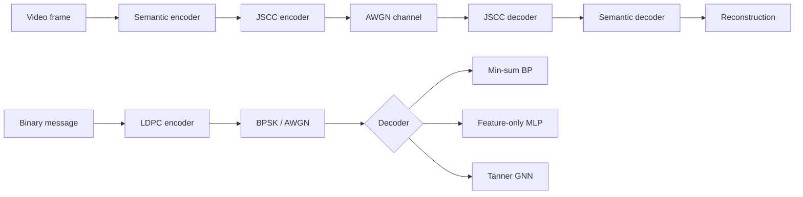

# NeuroJSCC-LDPC: Investigating Graph Structure in Neural LDPC Decoding

This repository preserves the original NeuroJSCC video reconstruction prototype
and adds a focused graph-machine-learning study of LDPC decoding. An LDPC
parity-check matrix defines a bipartite Tanner graph. The central experiment asks
whether that explicit connectivity improves decoding beyond the same noisy
channel observations available to a graph-blind model.

## Research questions

- **RQ1:** Can Tanner-graph edges be reconstructed from node attributes alone?
- **RQ2:** Does explicit Tanner connectivity improve decoding over a feature-only MLP?
- **RQ3:** How does that advantage change when the Tanner graph is perturbed?
- **RQ4:** Is edge reconstructibility associated with the GNN-versus-MLP performance gap?

For BER, where lower is better, graph gain is defined as

`delta_graph = BER_MLP - BER_GNN`.

A positive value favors the GNN. The scripts also report BLER, parameter counts,
individual seeds, and graph metadata. Summaries and figures aggregate real saved
runs; the repository contains no fabricated measurements.

## Existing NeuroJSCC system

The original code encodes 128×128 video frames with a convolutional semantic
encoder and reconstructs them with a mirrored decoder. The retained JSCC path
maps semantic latents to power-normalized real channel symbols, applies a
differentiable AWGN channel, and recovers the latent before image reconstruction.
Existing checkpoints, video data, models, and training/evaluation scripts remain
in place. See [the repository audit](docs/repository_audit.md) for the exact state
found before this extension.



The lower experimental path is deliberately separate from the continuous JSCC
latent path. Connecting them requires a defined quantizer and rate allocation;
the current project does not pretend that this bridge already exists.

## Methodology

`ldpc/tanner_graph.py` maps every `H[check, variable] = 1` to two directed PyG
edges while retaining variable/check index mappings and metadata. Tests recover
`H` from the resulting edges exactly.

The feature-only MLP receives the full vector of channel LLRs and scalar Eb/N0.
It sees no adjacency, edge index, degree, neighborhood statistic, centrality, or
structural embedding. Giving it the entire received word makes it a meaningful
global baseline rather than an artificially weak independent-bit classifier.

The GNN receives those same LLR and Eb/N0 observations. Variable nodes carry
their LLR; check nodes receive a zero in that channel-feature slot. A node-type
flag distinguishes the bipartition. PyTorch Geometric mean-message-passing layers
are the sole additional source of information, and predictions are read only at
variable nodes. Both models use the same codewords, noise realizations, splits,
seeds, epochs, optimizer family, and validation selection rule.

Normalized min-sum decoding provides a classical reference. BPSK uses `0 -> +1`
and `1 -> -1`; the configured SNR values are Eb/N0 and noise variance accounts
for code rate.

### Edge reconstructibility

The reconstruction diagnostic is independent of decoding. Logistic regression,
a small MLP, cosine similarity, and negative Euclidean distance predict candidate
variable/check edges. Inputs contain only node type plus normalized node labels
and Fourier encodings of those labels. Existing edges are used solely to assign
labels and select positive/negative examples. Uniform negatives sample random
zeros of `H`; hard negatives select zeros whose graph-independent positional
features are most similar.

This diagnostic has an important limitation: dynamic channel LLRs cannot identify
a fixed Tanner graph, and arbitrary node labels have no inherent physical meaning.
For the included deterministic cyclic construction, positional attributes can
measure how predictable the construction rule is. It must not be interpreted as
general recovery of an arbitrary LDPC graph, and random edge splits on one graph
are transductive. Multiple matrices or independently constructed graphs are the
right next step for stronger claims.

Perturbations use bipartite double-edge swaps. They preserve variable degrees,
check degrees, node counts, and edge count. They are structural ablations applied
to observations generated by the original code; a rewired matrix is not claimed
to remain the parity-check matrix of those transmitted codewords.

## Setup

Python 3.11 or newer is recommended. PyTorch Geometric 2.5+ uses current PyTorch
APIs for this project; no optional compiled PyG extension is required by the mean
aggregation layer used here.

```bash
python -m venv .venv
# Windows: .venv\Scripts\activate
# Linux/macOS: source .venv/bin/activate
python -m pip install --upgrade pip
python -m pip install -r requirements.txt
```

## Run experiments

Run from the repository root:

```bash
python -m experiments.edge_reconstructibility --config configs/edge_reconstruction.yaml
python -m experiments.mlp_vs_gnn --config configs/mlp_vs_gnn.yaml
python -m experiments.graph_perturbation --config configs/graph_perturbation.yaml
python -m experiments.reconstructibility_vs_gain
```

Each of the first three commands accepts `--smoke` for a fast integration check.
The full configs use seeds 0–4 and print per-epoch progress. The decoding grid
trains 25 seed/SNR conditions and can take roughly 10–20 minutes on a typical
CPU; `device: auto` selects CUDA when available. Output files are:

- `results/reconstructibility.csv`
- `results/reconstructibility_summary.csv`
- `results/decoding.csv`
- `results/decoding_summary.csv`
- `results/perturbations.csv`
- `results/perturbations_summary.csv`
- `results/correlation.csv`
- figures under `results/figures/`

Run the original components with `python main.py`, `python test_jscc.py`, or
`python -m training.train`. The video and matching checkpoints are already part
of the original repository history.

## Results

No research results are hard-coded. Run the commands above to populate the CSVs
and figures. Each row records the seed, code, SNR or perturbation, model, metrics,
parameter count, and graph size. Keep per-seed rows when reporting mean ± standard
deviation. The correlation script records Pearson and Spearman coefficients and
sample counts; these are descriptive associations and do not support
causal claims, especially for a small family of graphs.

## Reproducibility and configuration

`research_utils.set_seed` covers Python, NumPy, PyTorch, and CUDA and enables
deterministic algorithms where available. Dataset split seeds are separated so
train, validation, and test codewords/noise do not overlap. YAML files control
the code, seeds, Eb/N0 grid, sample counts, optimization budget, model sizes, BP
iterations, perturbations, device, and output paths.

## Repository structure

```text
models/, channel/, data/, training/, evaluation/  original NeuroJSCC system
ldpc/                                              coding, Tanner graph, BP
graph_learning/                                    datasets, MLP, GNN, diagnostics
experiments/                                       runnable research entry points
configs/                                           reproducible YAML settings
tests/                                             scientific sanity checks
results/figures/                                   generated outputs (ignored)
```

Run validation with:

```bash
python -m pytest
```
